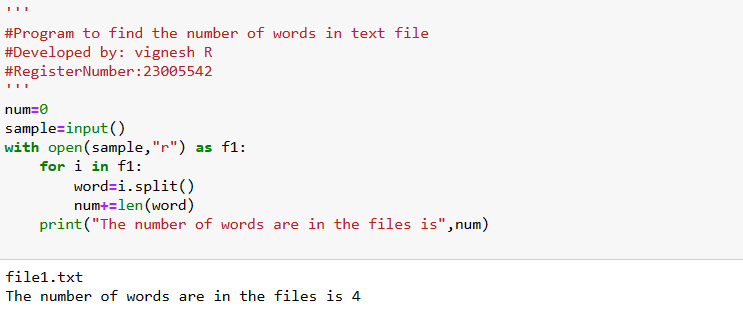
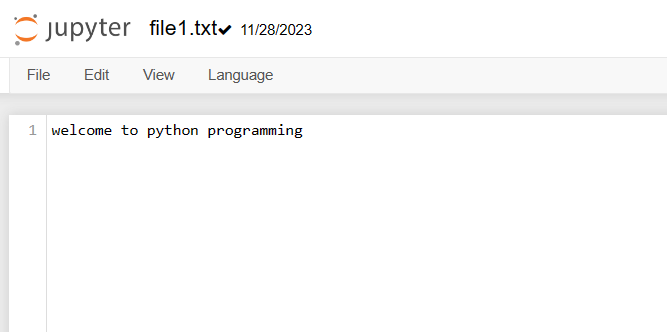

# Word-count
## AIM:
To write a python program for getting the word count from a text.
## EQUIPEMENT'S REQUIRED: 
PC
Anaconda - Python 3.7
## ALGORITHM: 
### Step 1:
Create a file with .txt file extension

### Step 2:
Add some text in that file

### Step 3:
Create a python file

### Step 4:
Write the code to count the number of words in that file

### Step 5:
Run the program

### Step 6:
Display the output
## PROGRAM:
```html
'''
#Program to find the number of words in text file
#Developed by: vignesh R
#RegisterNumber:23005542
'''
num=0
sample=input()
with open(sample,"r") as f1:
    for i in f1:
        word=i.split()
        num+=len(word)
    print("The number of words are in the files is",num)

```
### OUTPUT:




## RESULT:
Thus the program is written to find the word count from a text.
